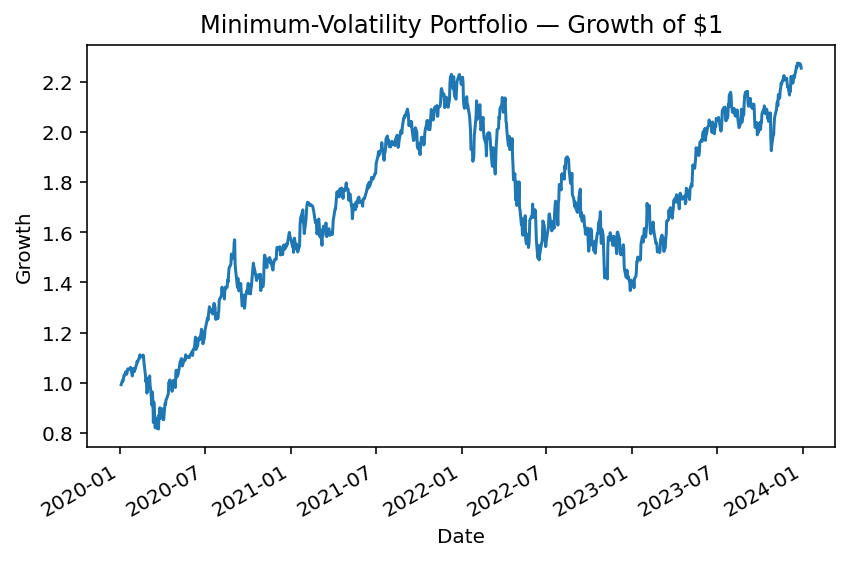
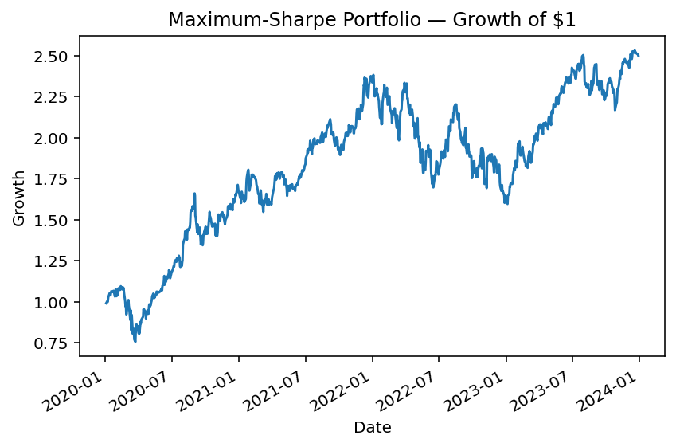

# FAANG Portfolio Optimization (2020–2023)


This project applies **Modern Portfolio Theory (Markowitz)** to a universe of **FAANG stocks**  
(**AAPL, AMZN, GOOGL, META, NFLX**) using daily market data from 2020 to 2023.

It explores how different portfolio optimization strategies perform in terms of **return, risk, and efficiency**:
- **Equal-weight portfolio** (naive benchmark)  
- **Minimum-variance portfolio** (risk minimization objective)  
- **Maximum-Sharpe portfolio** (risk-adjusted return maximization)

Using the **mean–variance optimization framework**, each portfolio is constructed under realistic constraints  
(no short-selling, full investment) and compared across key **performance metrics**:  
annualized return, volatility, Sharpe ratio, and portfolio weights.

The analysis demonstrates how optimization improves the **risk–return efficiency** of a portfolio  
even within a concentrated equity universe like FAANG.  
Visual outputs include the **efficient frontier**, **weights allocation**, and **performance comparison** charts.

---
## Project Structure 

```bash
faang-portfolio-optimization/
├── data/faang_prices.csv
├── src/
│   ├── part1_equal_weight.py
│   ├── part2_min_vol.py
│   ├── part3_max_sharpe.py
│   └── part4_comparison.py
├── reports/figures/
├── requirements.txt
└── README.md
```

---

## Analysis

### 1. Benchmark Portfolio — Equal Weight  
The baseline strategy allocates each asset an equal weight (1/N = 20%).  
This naive diversification approach serves as the reference point to evaluate optimized portfolios.  


---

### 2. Minimum-Variance Portfolio  
Built within the **Markowitz mean–variance framework**, this portfolio minimizes total volatility  
for a given set of assets under realistic constraints (*no short selling, fully invested*).

**Optimization problem:**

Minimize:   σₚ² = wᵀΣw  
Subject to: Σwᵢ = 1,  wᵢ ≥ 0  

where  
- σₚ² : portfolio variance  
- Σ : covariance matrix of asset returns  
- wᵢ : portfolio weights  

This portfolio achieves the **lowest attainable risk** given the data.
  



---

### 3. Maximum-Sharpe Portfolio  
This strategy maximizes the **risk-adjusted return**, defined by the **Sharpe ratio**.  
It finds the allocation that offers the **best trade-off between return and risk**.

**Optimization problem:**

Maximize:   S = (wᵀμ) / √(wᵀΣw)  
Subject to: Σwᵢ = 1,  wᵢ ≥ 0  

where  
- μ : expected returns vector  
- Σ : covariance matrix of asset returns  
- S : Sharpe ratio (with risk-free rate Rf = 0%)  

This portfolio provides the **highest expected return per unit of risk**.  



---

### 4. Portfolio Comparison  
All three portfolios — **Equal-Weight**, **Minimum-Variance**, and **Maximum-Sharpe** —  
are evaluated and compared across key performance metrics:  
- Annualized return  
- Annualized volatility  
- Sharpe ratio  
- Portfolio weights  
- Growth of $1 invested  

These comparisons highlight how optimization improves **risk–return efficiency**  
relative to naive diversification.


---


##  Methodology

**Universe:** FAANG (AAPL, AMZN, GOOGL, META, NFLX)  
**Period:** 2020-01-01 → 2023-12-31 (daily, close)  
**Data file:** `data/faang_stocks.csv` (wide format: Date + tickers)

**Preprocessing**
- Forward-fill and drop residual missing values on prices.
- Compute simple daily returns: `ret_t = price_t.pct_change()`.
- Annualization: mean × 252, stdev × √252.

**Risk/Return metrics**
- **Annualized return** \(E[R]\)
- **Annualized volatility** \(σ\)
- **Sharpe ratio** \(S = E[R]/σ\) with risk-free = 0%.

**Optimization**
- Solver: `scipy.optimize.minimize` (SLSQP)
- Constraints: **long-only** (wᵢ ≥ 0), **fully invested** (∑ wᵢ = 1)
- **Min-Var:** minimize \(wᵀΣw\)
- **Max-Sharpe:** maximize \((wᵀμ)/√(wᵀΣw)\)

All portfolios are built on the same dataset and evaluated with identical metrics.


---

##  Results

### Annualized Performance Summary 

| Portfolio      | Return | Volatility | Sharpe (rf=0) |
|----------------|--------|------------|---------------|
| Equal-Weight   | 23.60% | 32.69%     | 0.72          |
| Min-Vol        | 25.01% | 30.31%     | 0.83          |
| Max-Sharpe     | 28.01% | 31.75%     | 0.88          |

---

### Optimal Weights (%) 

| Ticker | Equal-Weight | Min-Vol | Max-Sharpe |
|--------|--------------|---------|------------|
| AAPL   | 20.0         | 39.84   | 78.74      |
| AMZN   | 20.0         | 14.91   | 0.00       |
| GOOGL  | 20.0         | 38.29   | 19.97      |
| META   | 20.0         | 0.00    | 0.00       |
| NFLX   | 20.0         | 6.96    | 1.29       |

## 📊 Results

### Annualized Performance (2020–2023)

| Portfolio      | Return | Volatility | Sharpe (rf=0) |
|----------------|-------:|-----------:|--------------:|
| Equal-Weight   | 23.60% | 32.69%     | 0.72          |
| Min-Vol        | 25.01% | 30.31%     | 0.83          |
| Max-Sharpe     | 28.01% | 31.75%     | 0.88          |

*All results are based on daily FAANG returns (2020–2023), annualized using 252 trading days and assuming a 0% risk-free rate.*

---

### Optimal Weights (%)

| Ticker | Equal-Weight | Min-Vol | Max-Sharpe |
|-------:|-------------:|--------:|-----------:|
| AAPL   | 20.0         | 39.84   | 78.74      |
| AMZN   | 20.0         | 14.91   | 0.00       |
| GOOGL  | 20.0         | 38.29   | 19.97      |
| META   | 20.0         | 0.00    | 0.00       |
| NFLX   | 20.0         | 6.96    | 1.29       |

---

### Performance Comparison

The **optimized portfolios** (Min-Vol and Max-Sharpe) both outperformed the naive equal-weight benchmark on a risk-adjusted basis.  
- **Min-Vol** achieved a **lower volatility** while improving the Sharpe ratio.  
- **Max-Sharpe** delivered the **highest risk-adjusted return**, albeit with a concentrated allocation (mainly AAPL and GOOGL).  

These findings confirm the benefits of **mean–variance optimization** even within a narrow FAANG universe.


---

##  Key Takeaways

- **Naive equal-weight** underperformed both optimized portfolios on a risk-adjusted basis.
- **Min-Vol** lowered volatility and improved Sharpe, concentrating on **AAPL + GOOGL**.
- **Max-Sharpe** further boosted Sharpe with a **concentrated** allocation (AAPL ≈79%, GOOGL ≈20%).
- Even within a narrow FAANG universe, **optimization improves risk–return efficiency**.
  

---

##  How to Run

1. Clone this repository and ensure `data/faang_stocks.csv` is available.  
2. Install dependencies:  
   ```bash
   pip install -r requirements.txt
Run the scripts in order (src/part1_... → src/part4_...).
All plots and results are saved in reports/figures/.    

---

## Tech Stack 

- **Python** (pandas, numpy, matplotlib, scipy)  
- **Optimization**: SLSQP (from `scipy.optimize`)  
- **Data**: FAANG daily prices (2020–2023) 


---


