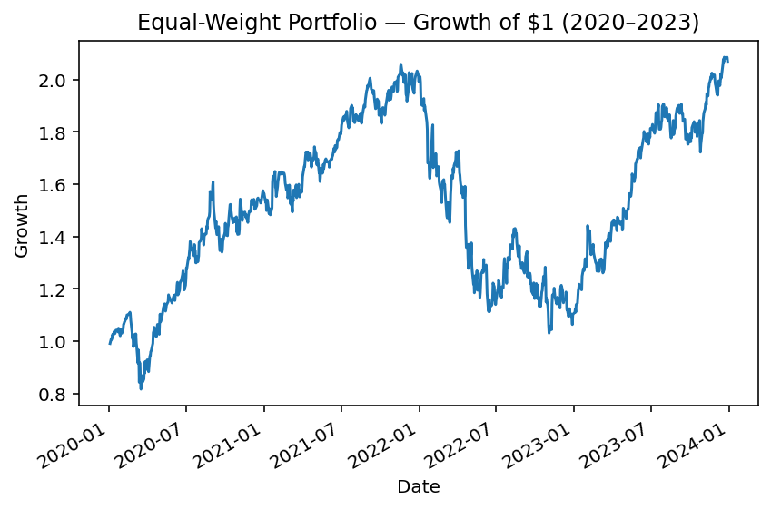
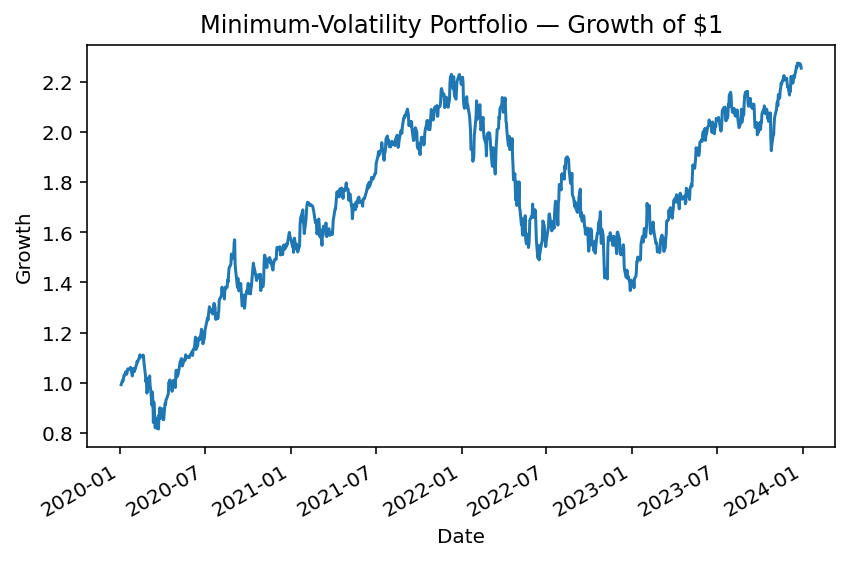
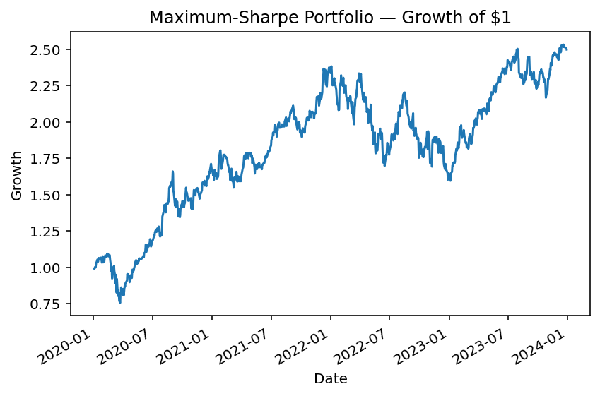
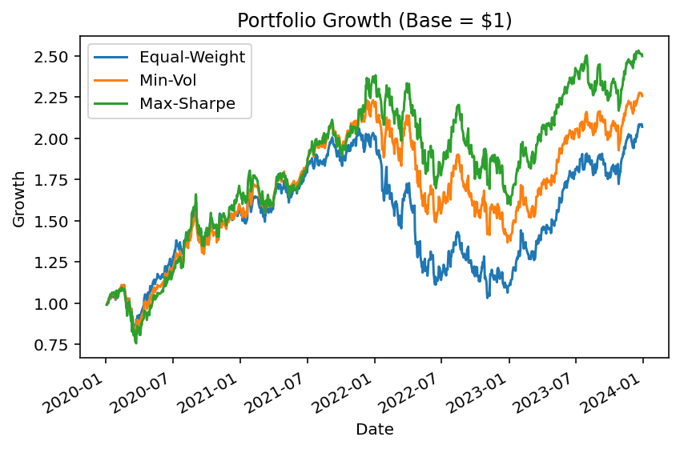

# faang-portfolio-optimization
Application of Modern Portfolio Theory (MPT) to FAANG stocks (2020–2023).  
Analyse de portefeuilles : équipondéré, volatilité minimale et Sharpe maximal.

# FAANG Portfolio Optimization (2020–2023)  
# Optimisation de Portefeuille FAANG (2020–2023)

This project applies **Modern Portfolio Theory (MPT)** to a portfolio of FAANG stocks  
(**AAPL, AMZN, GOOGL, META, NFLX**) using daily price data from 2020–2023.  

Ce projet applique la **Théorie Moderne du Portefeuille (Markowitz)** à un portefeuille FAANG  
(**AAPL, AMZN, GOOGL, META, NFLX**) en utilisant des données quotidiennes de 2020 à 2023.  

The objective is to compare different allocation strategies — from a simple equal-weight benchmark  
to optimized portfolios — and evaluate their **risk–return trade-offs**.  

L’objectif est de comparer différentes stratégies d’allocation — d’un portefeuille équipondéré simple  
à des portefeuilles optimisés — et d’évaluer leurs compromis **rendement/risque**.  

---

## 📊 Project Structure / Structure du projet

1. **Benchmark Portfolio (Equal-Weight) / Portefeuille de référence (Équipondéré)**  
   - Naive allocation: 20% in each stock.  
   - Allocation naïve : 20% dans chaque action.  

   

2. **Minimum Volatility Portfolio / Portefeuille à Volatilité Minimale**  
   - Mean–variance optimization.  
   - Optimisation moyenne-variance.  
   - Objective: reduce portfolio volatility.  
   - Objectif : réduire la volatilité du portefeuille.  

   

3. **Maximum Sharpe Portfolio / Portefeuille à Ratio de Sharpe Maximum**  
   - Mean–variance optimization.  
   - Optimisation moyenne-variance.  
   - Objective: maximize risk-adjusted return (Sharpe ratio).  
   - Objectif : maximiser le rendement ajusté du risque (Sharpe).  

   

4. **Comparison & Reporting / Comparaison & Reporting**  
   - Growth of \$1, annualized metrics, portfolio weights.  
   - Croissance de \$1, mesures annualisées, poids des portefeuilles.  

   

---

## ⚙️ Methodology / Méthodologie

- **Returns / Rendements**: arithmetic daily returns (`pct_change()`), annualized ×252.  
- **Volatility / Volatilité**: standard deviation of returns, annualized ×√252.  
- **Sharpe Ratio / Ratio de Sharpe**: (Return − Risk-Free) ÷ Volatility, risk-free = 0%.  
- **Optimization / Optimisation**: `scipy.optimize.minimize` (SLSQP), constraints:  
  - sum(weights) = 1 / somme des poids = 1  
  - weights ≥ 0 / pas de ventes à découvert  

---

## 📈 Results / Résultats

### Annualized Performance Summary / Résumé des Performances Annualisées

| Portfolio      | Return | Volatility | Sharpe (rf=0) |
|----------------|--------|------------|---------------|
| Equal-Weight   | 23.60% | 32.69%     | 0.72          |
| Min-Vol        | 25.01% | 30.31%     | 0.83          |
| Max-Sharpe     | 28.01% | 31.75%     | 0.88          |

---

### Optimal Weights (%) / Poids Optimaux (%)

| Ticker | Equal-Weight | Min-Vol | Max-Sharpe |
|--------|--------------|---------|------------|
| AAPL   | 20.0         | 39.84   | 78.74      |
| AMZN   | 20.0         | 14.91   | 0.00       |
| GOOGL  | 20.0         | 38.29   | 19.97      |
| META   | 20.0         | 0.00    | 0.00       |
| NFLX   | 20.0         | 6.96    | 1.29       |

---

## 🗝️ Key Takeaways / Points Clés

- **Naive diversification (Equal-Weight)** underperformed both optimized portfolios.  
- La **diversification naïve (équipondérée)** a sous-performé par rapport aux portefeuilles optimisés.  

- **Min-Vol Portfolio** delivered lower risk and improved Sharpe, favoring AAPL + GOOGL.  
- Le **Portefeuille Min-Vol** a réduit le risque et amélioré le Sharpe, en privilégiant AAPL + GOOGL.  

- **Max-Sharpe Portfolio** concentrated in AAPL (≈79%) and GOOGL (≈20%), achieving the best Sharpe.  
- Le **Portefeuille Max-Sharpe** s’est concentré sur AAPL (≈79%) et GOOGL (≈20%), atteignant le meilleur Sharpe.  

- Even within a concentrated FAANG universe, **optimization improves efficiency**.  
- Même dans un univers concentré comme les FAANG, **l’optimisation améliore l’efficacité du portefeuille**.  

---

## 🚀 How to Run / Comment Exécuter

1. Clone this repository and place `faang_stocks.csv` in the root folder.  
   Clonez ce dépôt et placez `faang_stocks.csv` à la racine.  

2. Run the Python scripts sequentially:  
   Exécutez les scripts Python dans l’ordre :  
   - `part1_equal_weight.py`  
   - `part2_min_vol.py`  
   - `part3_max_sharpe.py`  
   - `part4_comparison.py`  

3. Results (plots + CSV summaries) will be saved in the project directory.  
   Les résultats (graphes + CSV) seront sauvegardés dans le dossier du projet.  

---

## 🛠️ Tech Stack / Technologies Utilisées

- **Python** (pandas, numpy, matplotlib, scipy)  
- **Optimization / Optimisation**: SLSQP (from `scipy.optimize`)  
- **Data / Données**: FAANG daily prices (2020–2023)  

---

## 📌 Next Steps (Possible Extensions) / Prochaines Étapes (Extensions Possibles)

- Add **Efficient Frontier visualization** (Monte Carlo simulation).  
- Ajouter une **visualisation de la frontière efficiente** (simulation Monte Carlo).  

- Perform **scenario analysis** (COVID crash, 2022 sell-off, 2023 recovery).  
- Effectuer une **analyse de scénarios** (crash COVID, krach 2022, reprise 2023).  

- Introduce **transaction costs** or **short-selling constraints**.  
- Introduire des **frais de transaction** ou des **contraintes de ventes à découvert**.  

---

👤 **Author / Auteur**: E.Menassa  
💼 Aspiring Data & Risk Analyst | Passionate about Finance & Quantitative Research  
💼 Analyste Données & Risques en devenir | Passionné par la Finance & la Recherche Quantitative

